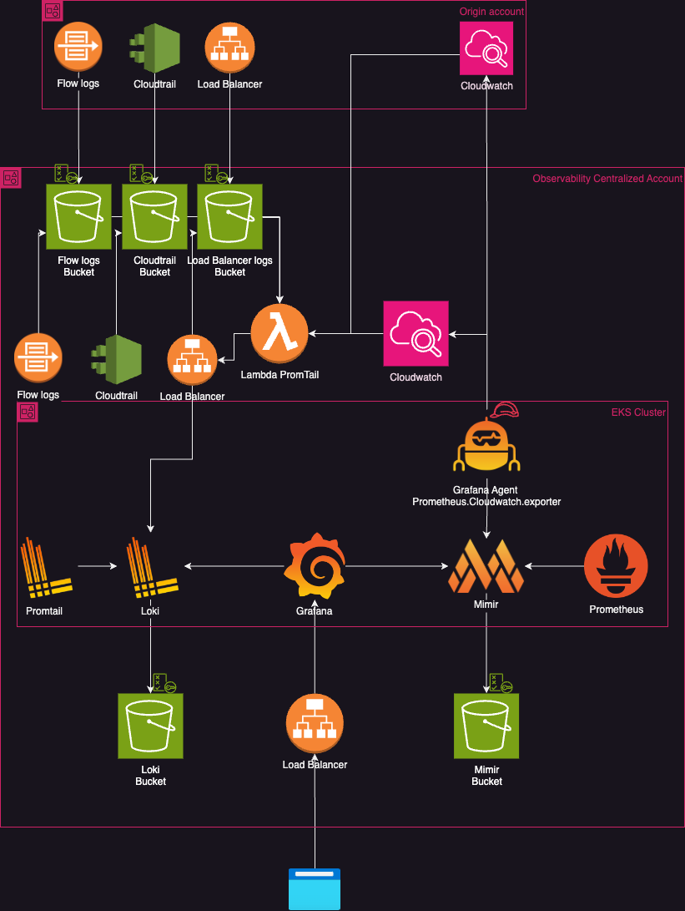

## WIP - please don't use it yet, working in progress
# Observability EKS opensource S3 backend

Using the stack, Grafana, Prometheus, Loki and Mimir

By relying on in Opensource tool and S3 storage we are achieving a high level of cost-effectiveness and resilience.

Tools applied:

- Grafana: A powerful open-source visualization and analytics tool that enables users to create dashboards and graphs by connecting to various data sources like Prometheus, Elasticsearch, and Loki.
- Prometheus: A CNCF-graduated monitoring and alerting toolkit, widely used for collecting and querying metrics in cloud-native environments, particularly with Kubernetes.
- Loki: A log aggregation system by Grafana Labs, designed to store and query logs efficiently. It integrates seamlessly with Prometheus and Grafana to provide context-rich monitoring.
- Mimir: A scalable metrics storage system by Grafana Labs, designed as an alternative to Cortex, optimized for high availability and storing large volumes of Prometheus metrics.
- PromTail: A lightweight agent for collecting logs and forwarding them to Loki. It acts as a bridge between log-producing systems and Loki, attaching metadata for easier log querying.
- S3: Amazon’s Simple Storage Service, an object storage platform widely used for scalable, durable, and secure data storage. It serves as a common backend for storing application data, logs, and metrics.
- Kubernetes: An open-source container orchestration platform that automates deployment, scaling, and management of containerized applications, forming the backbone of many cloud-native architectures.
- Helm Charts: A package manager for Kubernetes that simplifies the deployment and management of applications by bundling configuration files and templates into reusable, versioned packages.




## Deploy using

```terraform plan -var-file="test.tfvars"```

```terraform apply -var-file="test.tfvars"```

## Lint

`terraform fmt -recursive ../../ `

## Destroy using

```terraform destroy -var-file="test.tfvars"```


## Update eks config locally

`aws eks --region eu-central-1 update-kubeconfig --name gustavo-cluster-1`


